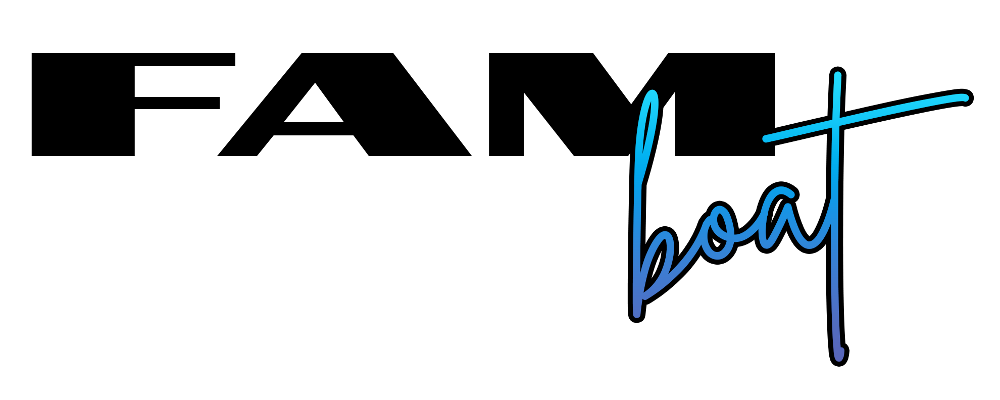

# 

# FAM Sync

FAM Sync is a private API developed to synchronize bookings from boat rental platforms to a Notion database. Built using Python and Flask, it is hosted on Koyeb to ensure seamless and efficient operations.

## Features

- **Parsing**: Parse bookings from Click&Boat
- **Synchronization**: Syncs bookings from various boat rental platforms to Notion.

## Technologies Used

- **Python**: Programming language used for development.
- **Flask**: Web framework used to create the API.
- **Koyeb**: Hosting platform used for deployment.
